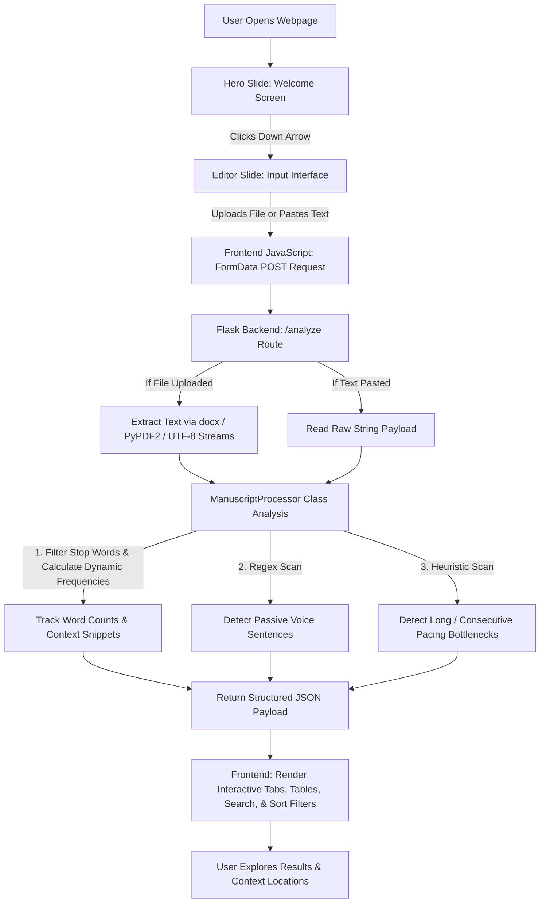

# Marginalia | Manuscript Analyser & Editor

A professional, full-stack Natural Language Processing (NLP) web application built for writers to analyze manuscripts for overused words, passive voice constructions, and structural pacing issues.

* **Live Web App:** [Access the Global Application](https://manuscript-app.onrender.com/) *(Hosted via Render)*
* **GitHub Repository:** [ozturksamira/manuscript_app](https://www.google.com/search?q=https://github.com/ozturksamira/manuscript_app)

---

## Interactive Interface & User Experience

The application features a modern, full-screen **snap-scrolling slideshow layout** utilizing a custom warm color palette (Pearl, Platinum, Tuscany, Raw Umber, Old Burgundy, and Eerie Black):

1. **Welcome Slide (Hero Section):** A dark, welcoming introduction screen featuring a smooth animated down arrow (`↓`) that snaps users directly into the core editor.
2. **Main Editor Slide:** Houses the multi-format file uploader (`.txt`, `.docx`, `.pdf`) and raw text pasting interface, connected to a dynamic tabbed dashboard:
* **Overused Words Tab:** Displays word frequencies, count totals, and direct context-location sentence links, enhanced with a live custom search bar and multi-sorting filters (Most/Least Used, A-Z, Z-A).
* **Passive Voice Tab:** Dynamically flags and isolates sentences containing passive constructions.
* **Pacing Issues Tab:** Spots overly long sentences and consecutive dragging segments.


3. **About Me Slide:** A professional footer section detailing the developer and linking directly to GitHub (`ozturksamira`).

---

## How the Webpage Works (Architecture Flowchart)



---

## Key Technical Features

* **Multi-Format Document Parsing:** Safely processes raw text strings, Microsoft Word (`.docx`), and Adobe PDF (`.pdf`) documents using server-side binary stream mapping (`io.BytesIO`).
* **Advanced Frequency Analysis:** Automatically strips out extensive stop-words (pronouns, articles, conjunctions) to surface genuine overused vocabulary alongside exact occurrence counts.
* **Contextual Location Tracking:** Maps flagged vocabulary back to the exact sentences they appear in, providing writers with immediate in-text context.
* **Client-Side Data Filtering & Sorting:** Instantaneous DOM manipulation allowing users to search specific words and sort metrics without page reloads.

---

## Local Installation & Setup

To run or inspect this project locally, follow these steps:

1. **Clone the Repository:**
```bash
git clone https://github.com/ozturksamira/manuscript_app.git
cd manuscript_app

```


2. **Create and Activate a Virtual Environment:**
```bash
python3 -m venv venv
source venv/bin/activate  # On Windows use: venv\Scripts\activate

```


3. **Install Dependencies:**
```bash
pip install -r requirements.txt

```


4. **Run the Flask Development Server:**
```bash
python3 app.py

```


5. **Open in Your Browser:**
Navigate to `[http://127.0.0.1:5000](http://127.0.0.1:5000)` to interact with the dashboard locally.

---

## Tech Stack & Requirements (`requirements.txt`)

* **Backend:** Python, Flask, Gunicorn
* **Document Parsing:** python-docx, PyPDF2, lxml
* **Frontend:** HTML5, CSS3 (Custom CSS Grid / Flexbox Snap Layout), JavaScript (ES6+ Asynchronous Fetch API)

```text
Flask
gunicorn
lxml==6.1.3
PyPDF2==3.0.1
python-docx==1.2.0
typing_extensions==4.16.0

```

---

## About the Developer

Built by **Samira Ozturk**.

* Check out more of my open-source applications on [GitHub (@ozturksamira)](https://www.google.com/search?q=https://github.com/ozturksamira).
